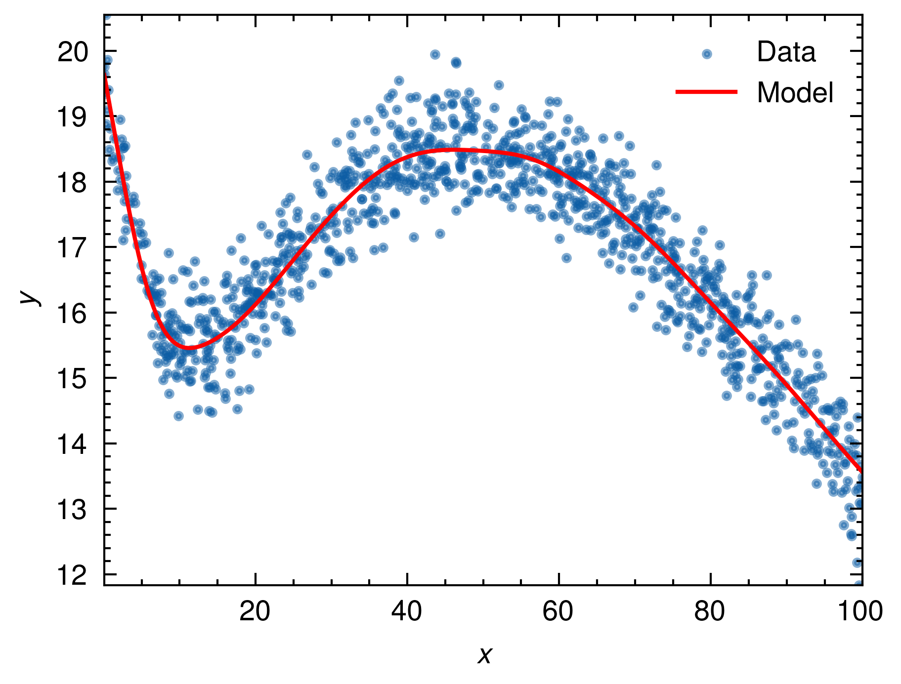

# Noisy Regression with Candle

This project demonstrates how to perform regression on noisy data using various Rust libraries for machine learning. The main libraries used in this project are:

- `peroxide`: A library for data generation, preprocessing and saving
- `candle`: A library for defining and training machine learning models
- `rayon`: A library for parallel processing
- `indicatif`: A library for progress tracking and visualization

## Key Features

1. Dataset Generation and Preprocessing
   - Generate noisy data using the `peroxide` library.
   - Split the data into train, validation, and test sets.
   - Scale the data using scalers such as `MinMaxScaler`, `StandardScaler`, and `RobustScaler`.

2. Model Definition and Training
   - Define an MLP (Multi-Layer Perceptron) model using the `candle` library.
   - Train the model using the Adam optimizer.
   - Track the training progress using the `indicatif` library.

3. Model Evaluation and Visualization
   - Evaluate the trained model on the test dataset and calculate the MSE.
   - Save the test results to a parquet file.
   - Visualize the predictions using `matplotlib`.

## Prerequisites

- Rust
- Python
- Required python libraries
  - `pandas`
  - `pyarrow`
  - `matplotlib`
  - `scienceplots`

## Usage

1. Run the Rust code:

   ```sh
   cargo run --release
   ```

2. Run the visualization script:

   ```sh
   python pq_plot.py
   ```

## Results

- The training and validation losses are printed during the training process.
- The MSE on the test dataset is displayed after the model evaluation.
- The predicted results are visualized and saved to the `test_plot.png` file.
  

## LICENSE

This project is licensed under the MIT license.
